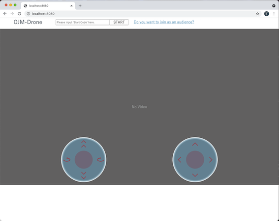
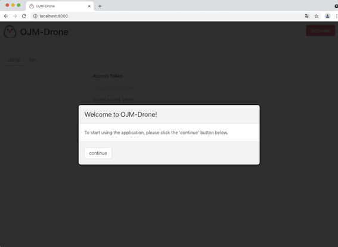
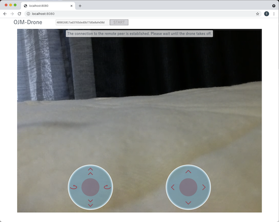

# ojm-drone-remote/ojm-drone-local

The toy application to control [Tello/Tello EDU](https://www.ryzerobotics.com/jp/tello) on a browser over the internet using WebRTC.
This application is made by the author personally and is **NOT** an official application by Ryze tech. 

This 'ojm-drone-remote' is used together with ['ojm-drone-local'](https://github.com/st-user/ojm-drone-local). So I'll explain about both 'ojm-drone-remote' and 'ojm-drone-local' in this README.


**Architecture image**


# System Requirements

 - Both ojm-drone-remote & ojm-drone-local

    - macOS 11
      - Safari 14 or later
      - Google Chrome (latest edition)
      - Microsoft Edge (latest edition)
    - Windows 10
      - Google Chrome (latest edition)
      - Microsoft Edge (latest edition)

 - ojm-drone-remote
    - Node.js 14 or later

 - ojm-drone-local
    - GO 1.16 or later

 - drone
    - [Tello/Tello EDU](https://www.ryzerobotics.com/jp/tello)


# How to install

After installing the applications using the commands below, you may need to edit the environment variables in `.env` files according to your environment.

For more infromation, please see the documentations on each variable in `.env` files.

If you want to just work through the 'How to use' below, you don't have to change them.

## ojm-drone-remote

### macOS
```
git clone https://github.com/st-user/ojm-drone-remote.git
cd ojm-drone-remote
npm install
cp template.env .env
```

### Windows 10
```
git clone https://github.com/st-user/ojm-drone-remote.git
cd ojm-drone-remote
npm install
copy template.env .env
```

## ojm-drone-local

### macOS

```
git clone https://github.com/st-user/ojm-drone-local.git
cd ojm-drone-local
cp template.env .env
```

### Windows 10

```
git clone https://github.com/st-user/ojm-drone-local.git
cd ojm-drone-local
copy template.env .env
```

# How to use

For simplicity, the guides below show the way that you run the applications on a single PC.
If you want to deploy the applications separately, for example you want to run 'ojm-drone-remote' on a server installed in another PC (not localhost), you need to change some environment variables in `.env` files
(at least, `SIGNALING_ENDPOINT` in `.env` of 'ojm-drone-local').

For more infromation, please see the documentations on each variable in `.env` files.

## Start the applications

### ojm-drone-remote

Open your terminal, move to the project's root directory and run:

```
node app.js
```

When the application starts without errors, open your browser and access:

```
http://localhost:8080
```

You should see a web page like:




### ojm-drone-local

**NOTE**: Please make sure that your PC on which 'ojm-drone-local' app runs successfully connects to Tello via Wi-Fi.


### macOS/Windows 10

For simplicity, **remove** the line below in `server/go.mod` file.

```
replace gobot.io/x/gobot => ../../gobot
```
(When you remove the line, 'ojm-drone-local' can't successfully resume the connection to Tello. So now I'm using the slightly modified version of [gobot](https://github.com/hybridgroup/gobot/) [Tello](https://github.com/hybridgroup/gobot/tree/release/platforms/dji/tello) module. (https://github.com/hybridgroup/gobot/issues/793))


Open the terminal different from the one that you run `node app.js` above, move to the project's root directory and run:

#### macOS

```
cd server
go mod tidy
env GO_ENV_FILE_PATH=../.env GO_STATIC_FILE_DIR=../client/static go run .
```

#### Windows 10

```
cd server
go mod tidy
set GO_ENV_FILE_PATH=..\.env
set GO_STATIC_FILE_DIR=..\client\static
go run .
```

When the application starts without errors, open your browser and access:

```
http://localhost:8000
```

You should see a web page like:



## Use the applications


1. At the 'ojm-drone-local' web page, click 'Generate' button.
2. At the 'ojm-drone-local' web page, click 'START' button.
3. At the 'ojm-drone-local' web page, copy the generated code ('Start Code').
4. At the 'ojm-drone-remote' web page, paste the 'Start Code' into the text box.
5. At the 'ojm-drone-remote' web page, click 'START' button.

   When the WebRTC connection between 'ojm-drone-remote' and 'ojm-drone-local' is successfully established, at the 'ojm-drone-remote' web page you can see the result like:

   

   **NOTE**:
   
   You should see the video that Tello caputures by its webcam.


6. At the 'ojm-drone-local' web page, click 'Takeoff' button.

   Tello takes off and at the 'ojm-drone-remote' web page, you can control Tello with the UI like a joy sticks!


**NOTE**:

If you don't get any error but can't see the video, please check your PC's firewall settings. It could be preventing the WebRTC connection.


# Using Docker

In order to run 'ojm-drone-remote' on docker container easily, the repository contains Dockerfile.

Especially you can deploy it to Google Cloud's [Cloud Run](https://cloud.google.com/run/) out of the box.

Example:

```
gcloud auth login
gcloud builds submit --tag gcr.io/<YOUR-PROJECT-ID>/<YOUR=APP=NAME>
gcloud run deploy --image gcr.io/<YOUR-PROJECT-ID>/<YOUR=APP=NAME> --platform managed
```

For more information, please see [Build and deploy a Node.js service](https://cloud.google.com/run/docs/quickstarts/build-and-deploy/nodejs)

# Using coturn (TURN Server)

When you want the applications to communicate with each other by WebRTC over the internet, usually you have to use TURN server.
I recommend using open source TURN Server [coturn](https://github.com/coturn/coturn) for this purpose.

In order to use [coturn](https://github.com/coturn/coturn), you need to set the environment variables in `.env` file of 'ojm-drone-remote' properly.

```
NODE_ENV=production
TURN_SECRET=....
HOURS_TURN_CREDENTIAL_VALID=...
STUN_URL=...
TURN_URL=...
```

For more information, please see the documentations in `.env` file of 'ojm-drone-remote'.


# LICENSE

MIT

**NOTE**:

Please do not use the icon(s) in the `client/assets` directory without the author's permission.